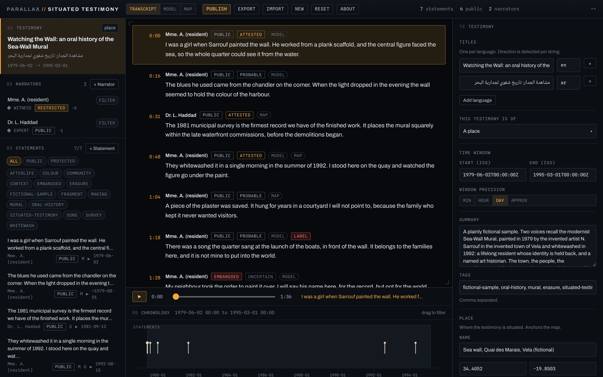
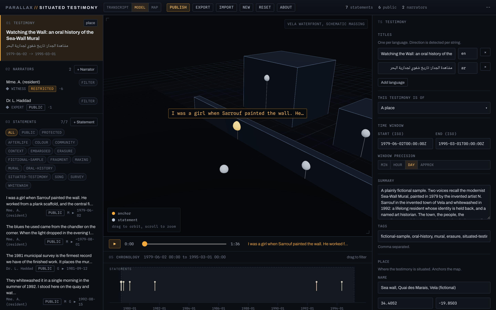
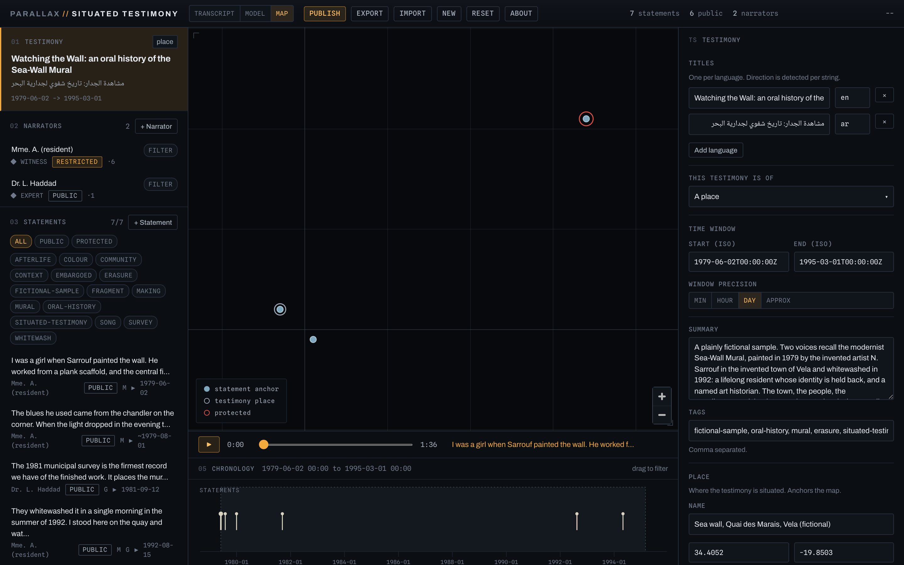
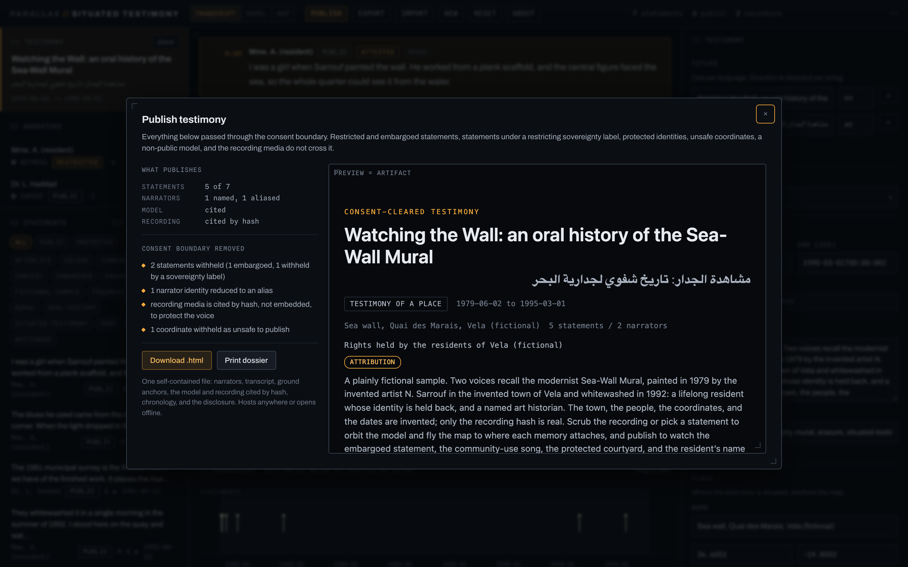
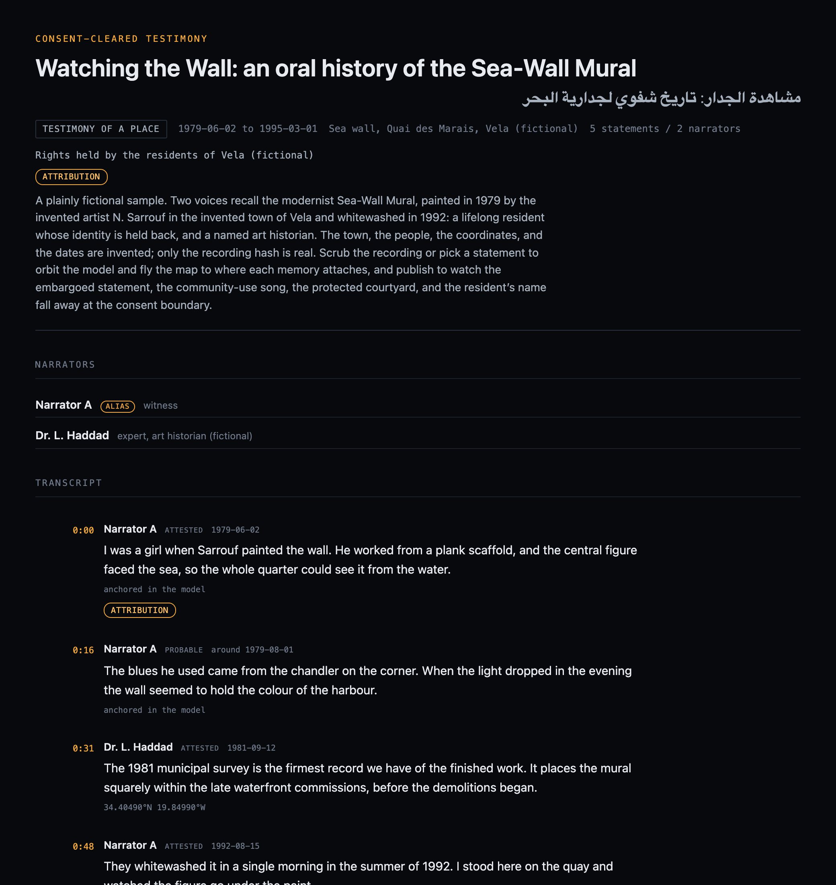

# Situated Testimony

**Attach an oral account to the place, the model, and the moment it concerns, under the narrator's own consent.**

Situated Testimony is a client-side, local-first workbench for testimony that is
*situated*: each statement in a recorded account is tied to where it happened (on
a map and on a 3D model of the site) and when (on a recording and a timeline), and
the whole is governed by the narrators' consent and the rights of the communities
involved. The output is a consent-cleared, self-contained static artifact.

It is the third instrument in the **Parallax** suite. Everything runs in your
browser. No file is uploaded, no map service is called, and the default basemap
fetches no third-party tiles, so nothing about the testimony or its location
leaves your machine.



---

## Contents

- [What it is](#what-it-is)
- [How it works](#how-it-works)
- [Install and run](#install-and-run)
- [The interface](#the-interface)
- [The testimony](#the-testimony)
- [Narrators](#narrators)
- [Statements](#statements)
  - [What a statement records](#what-a-statement-records)
  - [Anchoring a statement](#anchoring-a-statement)
  - [Consent and sovereignty on a statement](#consent-and-sovereignty-on-a-statement)
- [The recording transport](#the-recording-transport)
- [The three views](#the-three-views)
- [Consent, sovereignty, and release](#consent-sovereignty-and-release)
- [Publishing](#publishing)
- [Saving and sharing projects](#saving-and-sharing-projects)
- [Starting over: New and Reset](#starting-over-new-and-reset)
- [A worked example](#a-worked-example-end-to-end)
- [Keyboard and accessibility](#keyboard-and-accessibility)
- [Limits and caveats](#limits-and-caveats)
- [Privacy and data handling](#privacy-and-data-handling)
- [Troubleshooting](#troubleshooting)

---

## What it is

The question Situated Testimony answers is: **what does this witness say, where
does each thing they describe sit in the place, and when, and what may be made
public?** It is the situated-testimony method (the practice of recording an
account against a reconstructed space) turned into a working instrument, with
consent and community rights held as first-class parts of the record rather than
an afterthought.

A statement here is not a loose quotation. It is anchored: to a point on the map,
to a point on a 3D massing of the site, to a clip of the recording, and to a
moment on the timeline. Pick a statement and the model orbits to it, the map flies
to it, and the recording cues to its clip.

What it is **not**:

- Not a transcription tool or a subtitling editor. It situates statements; it does
  not produce the recording.
- Not a cloud tool. The recording and the model stay on your machine; nothing is
  uploaded.
- Not a sovereignty-management system of record. It carries a deliberately lean
  rights layer sufficient to govern what publishes, not a full CARE or TK Label
  registry.

---

## How it works

A testimony project is built from a few kinds of record:

- **The testimony** is the account as a whole: its titles, what it is of (a place,
  an event, an object), the narrators, a time window, a sovereignty block, an
  optional place that anchors the map, and optional **recording** and **model**
  attachments.
- **Narrators** are the voices: each has a name, a role (witness, expert), and an
  **identity consent** that decides whether the name may ever be published.
- **Statements** are the situated units of testimony: text in one or more
  languages, attributed to a narrator, with a certainty, a consent level, a
  sovereignty block, an optional clip of the recording, a time it refers to, and
  an anchor (a map point, a model point, or both).

Everything you publish or export passes through one **consent boundary**. It drops
statements that are not public or that carry a restricting sovereignty label,
reduces a protected narrator to an alias, withholds the model and unsafe
coordinates, and cites the recording by hash rather than embedding the voice.

Your records and media live in your browser's IndexedDB; the recording and model
bytes are held there and never uploaded.

---

## Install and run

Situated Testimony is a static client-side app built with Vite.

```bash
cd tools/situated-testimony
npm install        # first time only
npm run dev        # opens a local dev server (Vite prints the URL)
```

For a production bundle:

```bash
npm run build      # outputs to dist/
npm run preview    # serves the built bundle locally
```

On first launch the app loads a **fictional sample testimony** (two invented
voices recalling a mural) so there is something to drive immediately. Your work
saves to the browser automatically.

---

## The interface

The window has three columns and a dock. A left **rail** carries the testimony
card, the narrators, and the statements with their filters; a central **stage**
that switches between three views; a right **inspector**; and the **recording
transport** with the **chronology** docked along the bottom. The topbar holds the
view switcher, the actions, and a live **readout** (statements, how many public,
narrators).

- Click the **testimony card** to edit the testimony.
- Click a **narrator** or a **statement** row to select it; the inspector switches
  to its editor and the views follow the selection.
- The statement list has facet chips (**All / Public / Protected**, and tags), and
  each narrator row has a **filter** button that limits the statements to that
  voice.

Rail rows are keyboard-navigable: tab, then Enter or Space.

---

## The testimony

Selecting the testimony card opens its editor:

- **Titles.** One per language, direction detected per string.
- **This testimony is of.** A place, an event, or an object.
- **Time window** with a precision.
- **Summary** and **tags.**
- **Place.** A name, coordinates, a **safe to publish** toggle, and **Move on
  map**: the location the map view orients to.
- **Recording** and **model.** Attach the audio (or video) recording and the 3D
  model of the site; these power the transport and the Model view.

The testimony also carries a sovereignty block (a rights holder and any labels)
that applies to the account as a whole.

---

## Narrators

Press **+ Narrator**. A narrator has:

- **Name.** Held back in publication when identity consent is restricted.
- **Role.** Witness, expert, and so on, shown as a badge.
- **Identity consent.** **Public** (the name may publish) or **restricted** (the
  name is held back; in anything published the narrator becomes a stable alias,
  Narrator A, Narrator B).

A narrator's row shows a count of their statements and a **filter** that focuses
the transcript on that voice. A narrator with no surviving public statement is
dropped from the published artifact entirely.

---

## Statements

Press **+ Statement** to add one, attributed to the current narrator.

### What a statement records

- **Text.** In one or more languages, direction detected per string.
- **Narrator.** Which voice this statement belongs to.
- **Certainty.** Attested, probable, or uncertain.
- **Clip.** A start and end time in the recording; selecting the statement cues
  the recording here.
- **Refers to.** The moment the statement is about, which places it on the
  chronology.
- **Anchor.** A point on the map, a point on the 3D model, or both (see below).
- **Consent** and **sovereignty** (see below).

The statement's row and the transcript show badges for its consent, its certainty,
and its anchors (a **MODEL** badge, a **MAP** badge, a **LABEL** badge when a
sovereignty label applies).

### Anchoring a statement

A statement becomes situated when you anchor it:

- **On the map**: place a geographic point for where the statement's content sits.
- **On the model**: in the Model view, place a point on the 3D massing of the
  site, so the statement attaches to a wall, a corner, a position in the space.

An anchored statement is what lets the model orbit and the map fly to it when you
pick it.

### Consent and sovereignty on a statement

Each statement carries:

- A **consent level**: public, protected, or embargoed.
- A **sovereignty** block: a **rights holder** and optional **labels**. A label
  marked as restricting (for example a community-use label, "shared for the
  community, not for open publication") withholds the statement from anything
  published, whatever its consent flag says. This is how a community's decision
  about a song or a name is enforced by the tool, not left to the editor's memory.

---

## The recording transport

The dock beneath the stage is the transport: a play control, a playhead, the total
duration, and the text of the statement currently under the playhead.

- Press play to scrub the recording; the current statement is shown.
- **Selecting a statement cues the recording to its clip.** This is the
  synchronized move: the transcript, the recording, the model, and the map are one
  instrument, and picking a statement moves all of them together.

The recording itself is never embedded in the published artifact; it is cited by
its hash, to protect the voice.

---

## The three views

The view switcher (**Transcript / Model / Map**) changes the stage:

- **Transcript** is the account read in order, each statement timecoded to its
  clip, with its narrator, consent, certainty, and anchor badges. This is the
  default reading.
- **Model** is the 3D massing of the site. Drag to orbit, scroll to zoom; the
  statement anchors sit in the space, and selecting a statement orbits to it. The
  scene is a schematic massing, not a photoreal reconstruction: enough to situate a
  memory against a wall or a corner.
- **Map** places the statement anchors and the testimony place on the synthetic
  graticule. Selecting a statement flies to its anchor.

The Model and Map are drawn live in the browser; on a very first switch in some
environments they paint once you interact (orbit, or pan), which is a rendering
quirk of a backgrounded canvas, not a fault in the data.





---

## Consent, sovereignty, and release

Three controls govern what may publish, all enforced by the boundary rather than
by discipline:

- A statement's **consent level** (public, protected, embargoed).
- A statement's **sovereignty labels** (a restricting label withholds it).
- A narrator's **identity consent** (restricted names are aliased).
- A point's **safe to publish** flag, and the model's own consent.

When you publish or export, one boundary function (`publicClone`) runs over the
whole testimony and:

- drops statements that are not public, and drops public statements that carry a
  restricting sovereignty label;
- reduces a non-public narrator to a stable alias, and drops a narrator left with
  no surviving statement;
- withholds the 3D model unless its consent is public, and withholds the anchors
  that depended on it;
- withholds coordinates marked not safe to publish;
- cites the recording by its hash and never embeds the audio, so the voice itself
  is not released;
- omits private notes and internal keys.

The result is that a withheld name, an embargoed statement, a community-use song,
and a protected location all fall away at the boundary, together.

---

## Publishing

**Publish** in the topbar runs the testimony through the consent boundary and opens
a dialog showing what publishes (statements and narrators surviving out of the
totals), a plain-language list of everything withheld (statements dropped by
consent or by label, the narrator aliased, the recording cited by hash, the
coordinate withheld), and a live preview that is the artifact.



**Download .html** gives you a single self-contained file: the situated
transcript, the map of anchors, the chronology, the narrators as cleared, and the
consent disclosure. It opens offline and hosts anywhere.



---

## Saving and sharing projects

- **Export** saves the whole project as a single `.testimony.json` file, media
  included, so it round-trips exactly.
- **Import** loads a project file back.

---

## Starting over: New and Reset

- **New** starts an empty testimony (one unnamed narrator, no statements). It
  confirms in two steps in the toolbar; export first to keep the current one.
- **Reset** replaces the current testimony with the fictional sample, the same
  two-step confirm.

---

## A worked example, end to end

1. Attach the **recording** and a **model** of the site to the testimony.
2. Add the **narrators**, setting each one's **identity consent** (hold back the
   names that must be protected).
3. Add **statements** from the transcript, attributing each to its narrator and
   setting its **clip** in the recording.
4. **Anchor** each statement: a point on the map, a point on the model, or both.
5. Mark the consent level of each statement, and apply a **sovereignty label**
   (such as community-use) where a community has asked that material be held back.
6. Scrub the **recording**; confirm that selecting a statement cues its clip and
   moves the model and map.
7. **Publish**, confirm what the consent boundary withheld (the names, the
   embargoed and community-use statements, the recording, the protected place),
   and download the artifact.

---

## Keyboard and accessibility

The rail's narrator and statement rows are reachable by keyboard (tab, then Enter
or Space, with a visible focus ring); a narrator row's filter button keeps its own
behaviour. Text direction is detected per string, so right-to-left statements
display correctly. The model and map are pointer-driven (orbit, pan, zoom).

---

## Limits and caveats

- **A schematic model.** The 3D view is a massing of the site to situate
  statements against, not a measured or photoreal reconstruction.
- **You bring the recording and the model.** The tool produces neither; it situates
  what you supply.
- **The basemap is synthetic.** The map background is a graticule with no tiles; it
  gives geometry and scale, not satellite context.
- **A lean rights layer.** The sovereignty block governs what publishes; it is not
  a full sovereignty registry.

---

## Privacy and data handling

Situated Testimony is local-first. Records, the recording, and the model live in
your browser's IndexedDB and are never uploaded. The synthetic graticule basemap
makes no tile requests. The recording is never embedded in the published artifact,
only cited by hash, so the voice is not released. The published artifact is a
single file you control; nothing is sent anywhere unless you choose to share it.

---

## Troubleshooting

- **Selecting a statement does not cue the recording.** The statement has no clip;
  set its start and end times in the editor.
- **A statement is not on the chronology.** It has no "refers to" time; add one.
- **The model or map looks blank at first.** Orbit or pan once to force a redraw; a
  backgrounded canvas can defer its first paint.
- **A statement will not publish.** Check its consent level and its sovereignty
  labels; a restricting label withholds even a public statement.
- **A narrator vanished from the artifact.** All of their statements were withheld,
  so the boundary dropped the narrator too.

---

*Situated Testimony is part of the Parallax suite. Founded and directed by Jeff
O'Brien.*
